<h1 align="center">Goal Getter self-coaching website</h1>

## Contents

- <a href="#ux">User Experience (UX)</a>
- <a href="#feat">Features</a>
- <a href="#tech">Technologies Used</a>
- <a href="#test">Testing</a>
- <a href="#deploy">Deployment</a>
- <a href="#cred">Credits</a> 

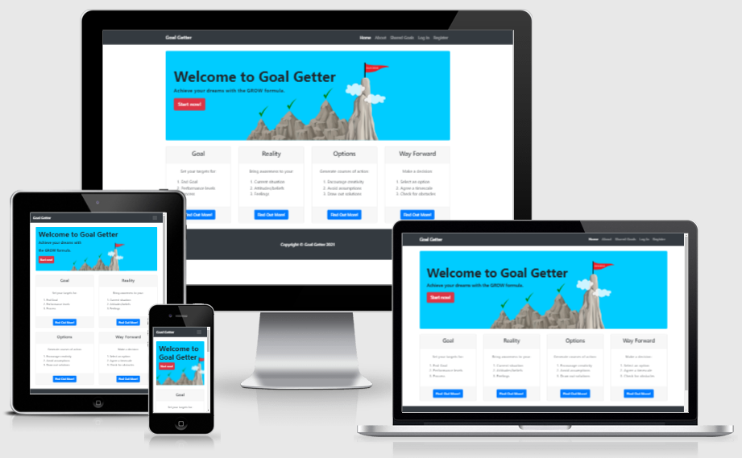
[View the live project here.](http://goal-getter-project.herokuapp.com/)

This is a website for the Goal Getter self-coaching web application.  The aim is to provide an easy-to-use motivational system for users to record, implement, update and achieve their life goals.  It is designed to work on a range of devices including desktop PCs, tablets and mobile phones.

## User Experience (UX)
### User stories
#### First Time Visitor Goals
1. Understand the site and how it can help me.
2. Use the site to find out how to achieve my goals.
3. Use the site to save money instead of paying a life coach.
4. Find out how others are using the site.
5. Register easily.
#### Returning Visitor Goals
1. Log in and out easily.
2. Create and add goals easily.
3. View and update my goals in one place.
4. Share my goals with others.
5. Use Goal Getter to improve my life.
6. Protect my account from unauthorised use.
#### Site Owner
1. Edit or remove content shared by others.
2. Add, edit or remove categories.
3. Protect my admin rights from unauthorised use.

### Design 
The Heroic-features template from startbootstrap.com was used for the home page and continued throughout the site.  This included a Jumbotron for a hero image and four thumbnail style feature boxes along the bottom.  The feature boxes were kept for the home page and reduced to one for the rest of the site.  This one thumbnail was used as a container for the Add goal form and other content depending on the page.

The Home page features a Welcome message with a strap line to ‘Achieve your dreams with the GROW formula’.  A call-to-action button is included to ‘Start now!’ which directs the user to the Register page.  The title for the website, home page Jumbotron background image and strap line with informational feature boxes clearly show the purpose of the site.

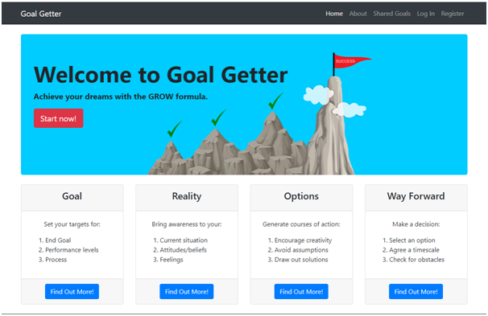

The Add and Edit Goal forms are created with Bootstrap Tabs.  This enabled the form to be displayed on one HTML page but retain separate sections for each GROW area.  

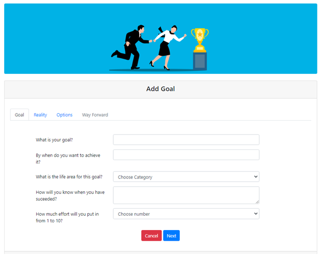

On the Shared Goals and Profile pages, goals are displayed using a Bootstrap card with a collapsible button which shows the completed Tabs form.  The use of Collapse and Tabs functionality enables details to be easily accessible with efficient use of space.

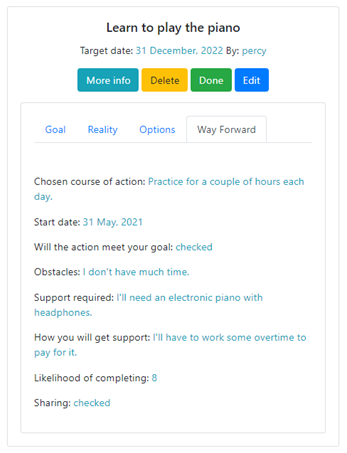

### Colour Scheme
The Heroic-features colour scheme was not altered.  This provided a dark menu bar and footer which was distinct to the grey header and footer for the feature boxes.  The main colour interest for each page is from the Jumbotron image.  Bold, bright imagery was preferred in order to inject some energy and excitement into the goal setting process. 
### Typography
It did not seem necessary to change the default Bootstrap fonts as these were clear and easy to read.  There was no other specific stylistic requirement to fulfil other than this. 
### Buttons
The default Bootstrap button colours were used.  It was considered that the default colours again provided the clarity and consistency needed.  This usage corresponded with Bootstrap recommendations as follows:
- Btn-info – More Info
- Btn-success – Done 
- Btn-warning – Delete (when proceeding a Confirm Delete modal) and Cancel
- Btn-primary – Submit, Edit or Find Out More!
    
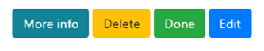

- Btn-danger – Delete, Start now! 
- Btn-secondary – Cancel, In Progress or Back
    
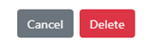

### Imagery
Vector graphics have been selected throughout in an effort to appeal to the user’s imagination rather than photos depicting stark reality.  Success with one’s life goals is often related to mental strength and leaps of faith. A vector graphic is the creator’s own version of reality and likewise Goal Getter is encouraging users to bring their own ambitions and versions of reality into being. 

The images have been picked to portray inspirational activities such as climbing towards a goal and reaching a mountain peak.  There are also motivational images featuring objects such as a rocket taking off and dart stuck in the bull’s eye of a dart board.  When people have been shown there has been an effort to show ethnic and gender diversity.
### Wireframes 
The wireframes for Desktop, Tablet and Mobile versions are [here.](https://github.com/thirdelement/goal-getter/blob/master/GoalGetter_wireframes.pdf)

These were created at the start of the project.  The resulting website is very similar but it does diverge from the wireframes in some areas.  These include:
  - The website uses Tabs for the Add Goal form rather than separate web pages. 
  - The profile page does not provide the capability to change your username and password.
  - The Shared Goals and Profiles page use Bootstrap cards rather than an Accordion.
  - The images shown have been changed in some cases.
  - The website does not include a Contact form.
### Database model 
The database model was a non-relational database structure with three collections for categories, goals and users.  A separate collection for each form section corresponding to Goal, Reality, Options and Way Forward was originally considered.  This was abandoned due to improved performance and reduction in database transactions with one goals collection.

The goals document is created when the user submits a new goal from the Options tab on the Add Goal page.  This saves options back to the database so they can be presented in a drop-down menu on the Way Forward tab.  Prior to this point the Way Forward tab is disabled.

On submission the user is directed from the Add Goal page to the Edit Goal page landing on the active Way Forward tab.  The user then selects a chosen option from the drop-down menu and updates the remaining fields before submitting again.

Therefore, there are two submissions to the database for each goal.  The original website design included a separate web page for each GROW section with four submissions per goal.  This design leverages an improved result with less database communication and fewer resources.

The database schema is [here.](https://github.com/thirdelement/goal-getter/blob/master/GoalGetter_Database-schema.pdf)
### Site map
The public website includes Home, About, Shared Goals, Log In and Register pages.  Once logged in, the standard user has additional pages for Profile, Add Goal, Edit Goal pages.  The Admin user has access to Categories, Add and Edit Categories.

The site map is [here.](https://github.com/thirdelement/goal-getter/blob/master/GoalGetter_sitemap.pdf)

<a style="text-align:right" href="#contents">Go to Contents :arrow_double_up:</a>

## Features
The Bootstrap toolkit was used throughout including:
  - [Grid](https://getbootstrap.com/docs/4.6/layout/grid/)
  - [Nav bar](https://getbootstrap.com/docs/4.6/components/navbar/)
  - [Modal](https://getbootstrap.com/docs/4.6/components/modal/)
  - [Tabs](https://getbootstrap.com/docs/4.6/components/navs/#tabs)
  - [Cards](https://getbootstrap.com/docs/4.6/components/card/)
  - [Collapse](https://getbootstrap.com/docs/4.6/components/collapse/)
  - [Forms](https://getbootstrap.com/docs/4.6/components/forms/)
  - [Alert](https://getbootstrap.com/docs/4.6/components/alerts/)
  - [Buttons](https://getbootstrap.com/docs/4.6/components/buttons/)

Responsive on all device sizes tested.
  - The use of the Bootstrap grid system and additional media queries enables the site to display effectively on a broad range of desktop, tablet and mobile screen sizes.  For example:
  - iPhone X
    
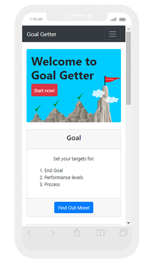

  - iPad 768px
    
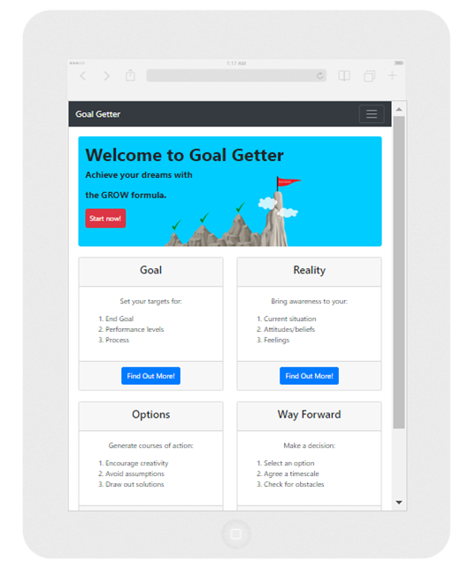

  - Secure registration and login 
    - Werkzeug security has been used to encrypt passwords.
  - CRUD
    - Users have the ability to create, update and delete their goals as well as read/view their own and shared goals.
    - The Admin has the same permissions as users with additional CRUD rights for categories and shared goals.
  - Sharing
    - Users have the ability to share and un-share goals.
  - User confirmation messages for all CRUD functions to ensure feedback at all time.
  - Defensive programming
    - Confirm Deletion
    - HTML validity reporting.
    - Comprehensive user error reporting.
    - The Way Forward tab in Add Goals form can be reached via the submit button only.  This ensures options are saved to database prior to presentation in drop-down list. 
  - Search
    - Full search capability on the Shared Goals page for goal name and chosen course of action fields.
  - 404 error handling
    - User are kept within the site with several return options available.
  - Datepicker
    - jQuery Datepicker was used within the Add Goal form.
  - Fully editable Add Goal form. 
### Future development
-   Admin feature to view and edit other user non-shared goals.
-   Account recovery and password reset using email.
-   Add function to choose additional options in the Way Forward tab. 
-   Add function to add small steps for achieving each option.
-   Add function to copy a goal.
-   Graphical display to show goal progress.
-   Pagination for Shared Goals and Profile.
-   Messaging between site users.
-   Use of WTForms for validation.
-   User session timeout.
-   Contact form.

<a style="text-align:right" href="#contents">Go to Contents :arrow_double_up:</a>

## Technologies Used
### Languages Used
-   [HTML5](https://en.wikipedia.org/wiki/HTML5)
-   [CSS3](https://en.wikipedia.org/wiki/Cascading_Style_Sheets)
-   [Javascript](https://en.wikipedia.org/wiki/JavaScript)
-   [Python](https://www.python.org/)
### Frameworks
1. [Bootstrap 4.6](https://getbootstrap.com/docs/4.6/getting-started/introduction/)
    - Bootstrap layout, content, components and utilities were used to structure the site and make it responsive.
1. [Flask](https://flask.palletsprojects.com/en/2.0.x/)
    - Flask was used to create the application and routes.
### Libraries  
1. [Werkzeug](https://jquery.com/)
    - Werkzeug was used for password encryption.
1. [jQuery](https://jquery.com/)
    - jQuery has been used for the DatePicker, Bootstrap Tabs buttons and to check validity. 
1. [Font Awesome](https://fontawesome.com/)
    - Font Awesome was used for the search icon.
### Templates
1. [Jinja](https://palletsprojects.com/p/jinja/)
    - Jinja was used for its templating engine.
1. [Start Bootstrap](https://startbootstrap.com/template/heroic-features)
    - Start Bootstrap Heroic-Features template was used as a basis for the site structure.
### Development & production platforms
1. [GitPod](https://gitpod.io/)
    - GitPod was used for code editing, version control, committing and pushing to GitHub.
1. [GitHub](https://github.com/)
    - GitHub was used to store and manage project code pushed from GitPod.
1. [Heroku](https://www.heroku.com/about)
    - Heroku was used for hosting the deployed web application.
1. [Mongodb](https://www.mongodb.com/)
    - Mongodb was used for Database creation and hosting.
### Other applications
1. [Irfanview](https://www.irfanview.com/)
    - Irfanview was used to resize, edit and add filters to images.
1. [Balsamiq](https://balsamiq.com/)
    - Balsamiq was used for [wireframes](https://github.com/thirdelement/goal-getter/blob/master/GoalGetter_wireframes.pdf) created during the design process. 
1. [Microsoft Word](https://www.microsoft.com/en-gb/microsoft-365/word)
    - Microsoft Word was used to create the database schema and site map.
1. [RGB to Hex converter](https://www.rgbtohex.net/)
    - This website helped with converting RGB colours to Hex for Jumbotron images.
1. [Favicon.io](https://favicon.io/favicon-converter/)
    - This website provided the capability for Favicon generation.
1. [Regexr](https://regexr.com/)
    - This website assisted with configuring the HTML validation pattern.

<a style="text-align:right" href="#contents">Go to Contents :arrow_double_up:</a>

## Testing
See Test report [here.](https://github.com/thirdelement/goal-getter/blob/master/TESTING.md)

<a style="text-align:right" href="#contents">Go to Contents :arrow_double_up:</a>

## Deployment
### MongoDB - create database
1.	Login to MongoDB.
2.	In Collections, click Create Database with initial collection name.
    
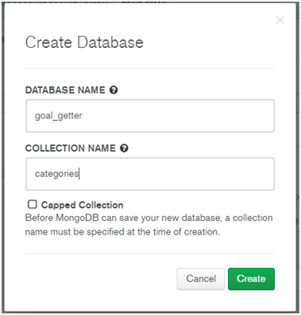

3.	Create collections for categories, goals and users
    
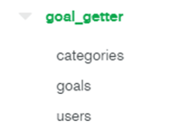

4.	Create a document in each collection for initial setup purposes: 
    Categories
    
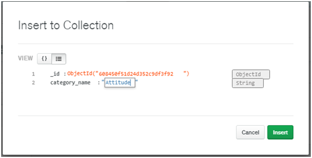

    Goals
    
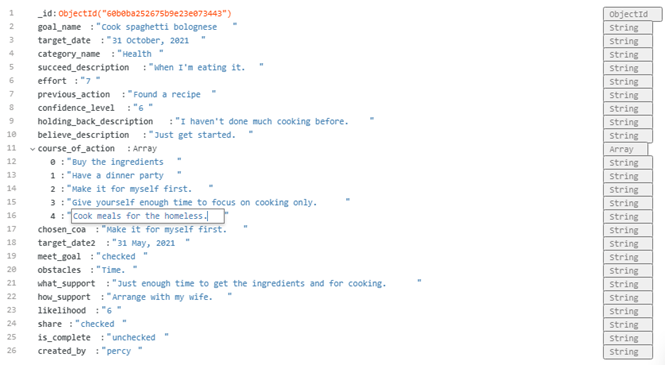

    Users
    
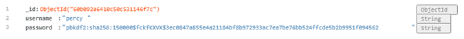

### GitHub/Gitpod - create app
1.	Create a GitHub repository and open via Gitpod.
2.	In Gitpod terminal run the following commands: 
    `pip3 install Flask` 
    `touch app.py` 
    `touch env.py` 
    `touch .gitignore` 
    
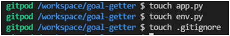

3.	Ensure env.py and __pycache__ are included in .gitignore
    
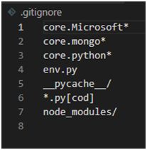

4.	Add the following to env.py:
    
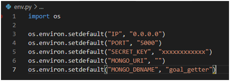

5.	Create a requirements.txt file for Heroku to know what apps and dependencies are required.
    
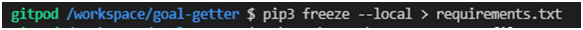

6.	Create Procfile so Heroku knows which file runs the app and how to run it.
    
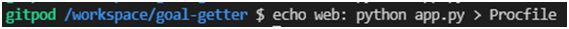

### Heroku - create app
1.	Log in to Heroku and click New, Create new app (also required to add name and region).
2.	In the Deploy menu, Deployment method select GitHub.
    
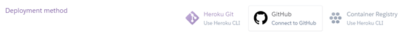

3.	Check GitHub profile is displayed then add repository name and click Connect.
    

    Do not enable Automatic Deploys at this time.  Since we have the env variables within the hidden env.py file, Heroku will not be able to read them. 
4.	Click Settings, Reveal Config Vars and add details from env.py:
    
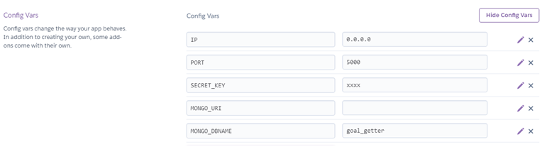

5.	In Gitpod ensure that you commit and push requirements.txt and Procfile.
6.	Enable Automatic Deploys.
    

7.	Click Deploy Branch.
    
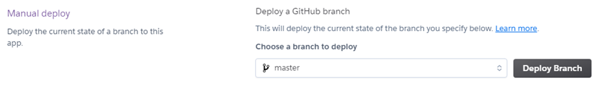

8.	Check app was deployed ok.
    
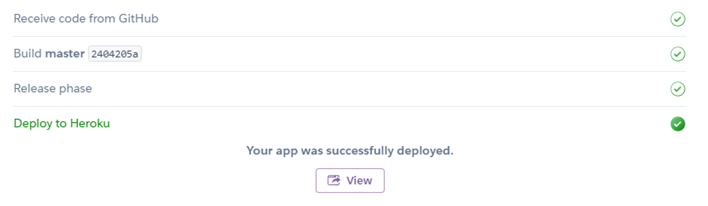

### Gitpod - Connect Flask to Mongodb
1.	Install flask-pymongo which is a third party library required for Flask to communicate with Mongodb.
    
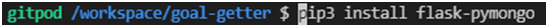

2.	Install dnspython in order to use the Mongo SRV connection string.
    
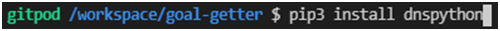

3.	Update requirements.txt and save.
    
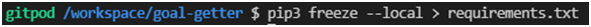

4.	Add additional imports to app.py to reflect new installations.  This includes BSON which is a JSON-like format in which Mongodb stores data.
5.	Update connection settings in app.py.
    
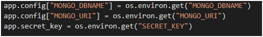

### Mongodb - Connect to application
1.	In Mongodb go to Clusters, Overview, Connect, Connect your application.
    
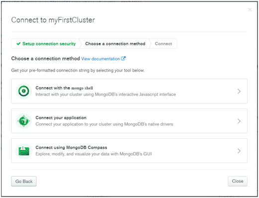

    
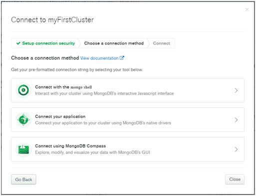

### Gitpod - Additional settings
1.	Copy the connection string and add to MONGO URI value in env.py:
    
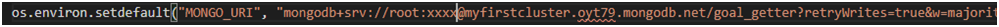

2.	Add to MONGO_URI in ConfigVars in Heroku.
    

3.	In app.py set up an instance of PyMongo and add the app using a constructor method.
    
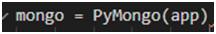

4.	Add initial get_goals function.
    
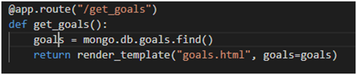

5.	Add additional functionality from Flask.
    
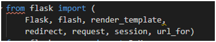

6.	Create the templates.
    

7.	Create base.html as a parent template for all views and templates.  This contains all references to external files and third party libraries for Bootstrap, JS and CSS.
8.	Add Werkzeug to app.py and requirements.txt.
    
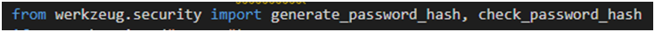

### Gitpod - Additional settings
1.	Log into GitHub and locate the goal-getter repository
2.	Under the repository name, click ‘Clone or download’.
3.	To clone the repository using HTTPS, under ‘Clone with HTTPS’, copy the link.
4.	Opt Git Bash
5.	Change the current working directory to the location where you want the cloned directory to be made.
6.	Type git clone, and then paste the URL you copied in step 3. 
`$ git clone https://github.com/thirdelement/goal-getter` 
7.	Click Enter.  Your local clone will be created.

Please see [this link](https://docs.github.com/en/github/creating-cloning-and-archiving-repositories/cloning-a-repository-from-github/cloning-a-repository#cloning-a-repository-to-github-desktop) for more detailed explanation.

<a style="text-align:right" href="#contents">Go to Contents :arrow_double_up:</a>

## Credits
### Code
- The site was based on the Code Institute Task Manager project.
- Bootstrap 4.6 was used throughout the site so that it is responsive to different devices and viewport sizes..
- Code was used from external sources in the following instances:
  - [Show HTML validity messages.](https://stackoverflow.com/questions/32829776/setting-custom-html5-validity-message-property-ignores-pattern-regex)
  - [Display message if Add Goal form does not meet validity requirements.](https://stackoverflow.com/questions/45789010/how-to-use-html-form-checkvalidity/45789752)
  - [Bootstrap Tab buttons.](https://stackoverflow.com/questions/45789010/how-to-use-html-form-checkvalidity/45789752) 
  - [jQuery Datepicker.](https://getbootstrap.com/docs/4.6/components/navs/#javascript-behavior)
  - [Several submit buttons on the same form.](https://stackoverflow.com/questions/43811779/use-many-submit-buttons-in-the-same-form)
  - [Error 404 handling.](https://www.geeksforgeeks.org/python-404-error-handling-in-flask/)
  - [Use background image and background color together.](https://stackoverflow.com/questions/903659/why-cant-i-use-background-image-and-color-together)
  - [Correct regex usage.](https://stackoverflow.com/questions/903659/why-cant-i-use-background-image-and-color-together)
  - [Regex pattern.](https://regexr.com/)
### Content
- All content was written by the developer.
### Content
The images used all had Creative Commons licences:
  - [Cogs](https://pixabay.com/vectors/gear-options-preferences-settings-149292/)
  - [Grow-diagram](https://commons.wikimedia.org/wiki/File:GROW_cycle.png)
  - [Man-crossroads](https://commons.wikimedia.org/wiki/File:Cartoon_Man_Arriving_At_A_Career_Crossroad.svg)
  - [Man-woman-trophy1](https://pixabay.com/vectors/business-competition-trophy-cup-5820660/)
  - [Mountains-success](https://pixabay.com/illustrations/success-customer-achievement-goal-4369215/)
  - [People1](https://pixabay.com/illustrations/people-cartoon-man-comic-fun-4879060/)
  - [Rocket](https://pixabay.com/vectors/rocket-rocket-launch-launch-space-4984618/)
  - [Woman-mountaintop](https://pixabay.com/vectors/success-woman-mountain-top-concept-5836546/)
  - [World-growth6](https://pixabay.com/vectors/world-growth-statistics-chart-6158920/)
  - [Target-arrow](http://www.mepixels.com/photo/target-2880)
  - [Favicon](https://pixabay.com/vectors/target-arrow-bulls-eye-bullseye-2070972/)
### Acknowledgements
-	Anto Rodriguez for his mentoring and advice.
-	Code Institute Tutors for assistance with structure and routing. 
-	Ed Bradley for MS3 prep session and useful example project.

<a style="text-align:right" href="#contents">Go to Contents :arrow_double_up:</a>
