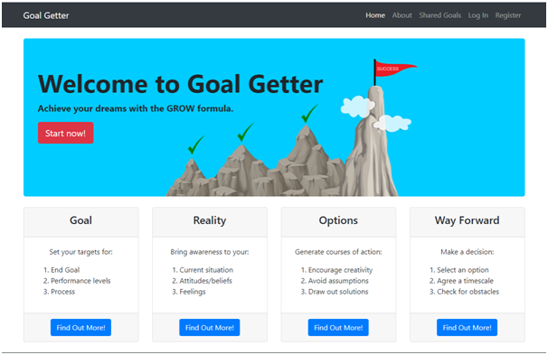
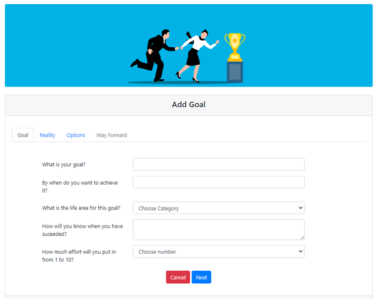
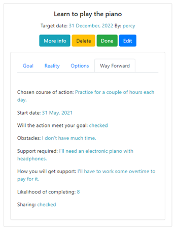
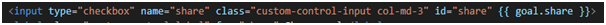
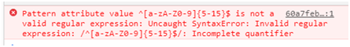
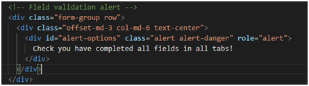
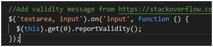

<h1 align="center">Goal Getter self-coaching website Test report</h1>

## Contents

- <a href="#stories">User Stories</a>
- <a href="#manual">Manual Tests</a>
- <a href="#resp">Responsiveness</a>
- <a href="#issue">Issues & Bugs</a>
- <a href="#other">Other Tests</a> 

[View the live project here.](http://goal-getter-project.herokuapp.com/)

## User Stories
### First Time Visitor Goals
#### Understand the site and how it can help me
- The home page of the website has descriptive website title, clear motivational hero-image showing incremental steps to success and call-to-action to ‘Achieve your dreams with the GROW formula’.
- Below the image are thumbnail styled feature boxes describing each stage of the GROW process with buttons on each to ‘Find Out More!’.  These four feature boxes mirror the four incremental steps in the hero-image.

- The ‘Find Out More!’ buttons link to the About page.  This contains an additional summary of what the website does, some background on GROW and a diagram showing how it works.

#### Use the site to find out how to achieve my goals
- As described in the User Experience (UX) section in README.md, the website provides a straight-forward registration and login process.  On registration, the user lands on their Profile page which has a call-to-action to ‘Click here to add a goal’ in the middle of the page.

- The Add Goal form guides the user through a series of questions for each section of the GROW model.  These are designed to bring the user’s awareness to their situation, realise their responsibility for changing it and guide them through a means of doing it.  
- The user proceeds to set their goal, describe their reality, determine options and select at least one of these to work towards their goal.
#### Use the site to save money instead of paying a life coach
- Whilst Goal Getter is not a substitute for a real life coach, a coaching session will often use the GROW model.  Additionally, one aim of coaching is to enable the coachee to self-coach and it is this that Goal Getter can help with.
- Goal Getter provides the means for users to interrogate their goals and options from all angles.  It provides users with a considered action plan which they create as a way forward.  Goal Getter can be part of a user’s toolkit used to gain insight and structure in the goal achievement process.
#### Find out how others are using the site
- The Shared Goals page is available from the menu bar to public access users who are not yet registered.  Here goals that are in progress can be viewed with the ‘More Info’ button on each to view the full goal content.
- There is a search bar here which can be used to search for goal name and chosen course of action.

#### Register easily
- The ‘Start Now!’ button on the home page hero-image directs the user the to the Registration page.  This ‘Start Now!’ button is shown on the About page and a link is also available on the menu bar.  Therefore, a user should be able to navigate to the Registration page itself easily.
- The registration process requires the user to enter a username and password and click the Register button only.  There is a clear message to ensure validation criteria are met reporting ‘Letters or numbers from 5 to 15 characters required’.  

### Returning Visitor Goals
#### Log in and out easily
- There is a Log In link on the menu bar that is easily accessible.  When clicked this takes the user to the Log In page which has the same layout as for Registration.  
- There is link below the password box on the Registration page for re-direction to the Log In page and vice versa in case the user mistakenly finds themselves in the wrong place.
- As with the Registration page there is a clear validation message in case criteria are not met.  In a situation where incorrect details are added a clear message is displayed to this effect.

On successful log in a welcome message is displayed and the user lands on their Profile page.

#### Create and add goals easily 
- From the Profile page the user has a couple links for adding a goal as described above.
- Once Add Goal is clicked, the user is presented with a form with four tabs aligning to the four stages of the GROW goal setting model.

  

- Each tab contains questions with an 'input' or 'textarea' box for the user to enter an answer.  The min length for each box is 2 characters and the user receives a validation message on input.

- There are a couple of fields requiring a date which the user can select using a Datepicker:

- Two fields use drop-down menus to select a number and a category:

- On the Goal and Reality tabs the user clicks ‘Next’ to proceed or can use the tab links.  The Way Forward tab is disabled until the user has clicked the ‘Submit’ button in the Options tab.  This allows the options to be saved to the database for display on the Way Forward tab in a drop-down menu.  On submission the form details are saved to the database and confirmation message shown.

- If any fields are incomplete or do not meet the min or max length criteria an error is displayed above the form header and the Submit button.  The error is shown in both locations to ensure the user doesn’t miss it.

- The Way Forward tab has a drop-down menu of responses entered on the Options tab.

- There are two switches on this tab.  The first of these is required to be set to 'on' by the user to confirm the selected action will meet their goal. 

- The user will receive an error and be unable to submit the form until this is done.

- he second switch is on by default and will add the goal to the Shared Goals page.  If the user does not wish to share their goal, this switch can be turned off.

- Once all fields are completed and the user clicks Submit the goal is saved and they are returned to the Profile page.  

#### Create and add goals easily 
- Once registered or logged in, the user is taken to the Profile page.  This includes headings for My Goals In Progress and My Goals Completed.  If no goals have been created then there is a message that nothing has been added with a link to do so (as shown above).  Alternatively, the user can click ‘Add Goal’ from the menu bar.
- Once a goal is created it is added to My Goals In Progress.

- For each goal shown in Profile there are buttons for More Info, Delete, Done and Edit.
- The More Info tab expands the goal card to show the form tabs and answers.

- If the user clicks Delete a Confirm Deletion modal dialogue box appears.  

- When the Delete on this dialogue box is clicked, the goal is deleted from the database and a confirmation message is shown:

- If the user clicks Done the goal is moved to My Goals Completed and a confirmation message is displayed.

- If the user clicks Edit they are directed to the Add Goal form as before where they can make changes.
- In My Goals Completed the user can click on In Progress to move the goal back to My Goals In Progress.
#### Share my goals with others 
- As mentioned above, on the Way Forward tab of the Add Goal form there is a switch which can be turned on or off to share or un-share a goal.
#### Use Goal Getter to improve my life 
- The Goal Getter site has been created to enable users to self-coach.  The Add Goal form features questions that have been carefully chosen to enable the user to gain increased awareness of their current situation and dig deep to create options.  
- There are other features to keep the user focussed on their end results such as a switch on the Add Goal Way Forward tab the user needs to enable before submission.  This ensures they have thoroughly checked their options and confirmed what they have chosen will enable them to reach the desired result.
- The Goal Getter goal sharing option is also geared to provide extra motivation for users.  The reasons for sharing goals can include making yourself accountable and so increase the chances of achieving the goal, impressing others with what you have achieved and for other social or training purposes. 
- Goal Getter is one of many tools that can be used to improve your life.
#### Protect my account from unauthorised access
- A check has been added to the URL routing to ensure that a logged in user only has access to non-public web pages.  If a session cookie is not detected, an error message appears and they are re-directed to the login page.

### Site Owner
#### Edit or remove content shared by others
- The application is configured with one administrator account which has permissions for Delete, Done and Edit buttons in Shared Goals.

#### Add, edit or remove categories
- The Admin account only has access to the Manage Categories option from the menu bar.  The page displays all current categories with Delete and Edit buttons for each.

- If the admin clicks Delete on a category, a Confirm Deletion modal is launched.  

- When Delete is clicked on the modal the category is deleted from the database and a notification appears.

- The Edit button directs to an Edit Category page where the name can be changed.

- A notification is displayed once the category has been updated:

- A category can be added using the Add Category button at the bottom of the Manage Categories page.  This launches an Add Category page where a category can be entered and submitted. 

- Once a new category is added the usual confirmation is displayed.

#### Protect my admin rights from unauthorised use.
- A check has been added to the URL routing to ensure that an admin user only has access to admin web pages.  If the user is not an admin, an error message appears and they are re-directed to their Profile page.

<a style="text-align:right" href="#contents">Go to Contents :arrow_double_up:</a>

## Manual Tests
The following items have been successfully tested on each page or component:
### Menu bar
- Goal Getter logo link to home page.
- Menu bar links to correct site page.
### Home page
- Start Now! button links to Register for public user.
- Start Now! button links to Add Goal for session user.
- Find Out More! buttons link to About.
### About
- Start Now! button links to Register for public user.
- Start Now! button links to Add Goal for session user.
### Shared Goals
- Search bar finds items via goal name and chosen course of action.
- Search button working.
- Each goal shows the goal name, target date, creator and content correctly.
- Reset button resets search successfully.
- More Info button shows goal content and collapses on second click.
- Delete, Done and Edit buttons are available on each goal to Admin user and session user who created the goal only.
- Delete button launches Delete modal.  
    - Cancel on the modal returns to Shared Goals.
    - Delete on the modal removes the goal from the site and database.  A notification is shown on Deletion.
- Done button remove goal from page and notification shown.
- Edit button launches Add Goal form with previous answers.
### Log In
- HTML validation message showing correctly on both username and password boxes.
- Notification appears if details entered incorrectly and on successful login.
- Register account links re-directs correctly.
- User is logged in successfully and taken to profile.
- Welcome message displayed on login.
### Register
- HTML validation message showing correctly on both username and password boxes.
- Notification appears if details entered incorrectly and on successful login.
- Passwords are hashed successfully.
- Login link re-directs correctly.
- On registering correctly user is logged in and taken to profile.
- Welcome message displayed on login.
### Profile
- For new users profile is blank with links to add a goal.
- Once goal created it is shown in My Goals In Progress.
- More Info, Delete, Done and Edit buttons are available on each goal.
- More Info button shows goal content and collapses on second click.
- Delete button launches Delete modal.  
    - Cancel on the modal returns to Shared Goals.
    - Delete on the modal removes the goal from the site and database.  A notification is shown on Deletion.
- Done button moves goal to My Goals Completed.
- Edit button launches Add Goal form with previous answers.
- Each goal in My Goals Completed has a More Info, Delete and In Progress button.
- In Progress button moves the goal back to My Goals In Progress.
- A non-logged receives an error and is returned to the login page.
### Add Goal
- The tab links open each tab
- The Way Forward tab is disabled until the form is submitted on the Options tab.
- A non-logged receives an error and is returned to the login page.
#### Goal & Reality tabs
- HTML validation messages are showing correctly for each field.
- The Datepicker launches successfully.
- The drop-down menus work.
- The Next, Back and Cancel buttons work. 
#### Options tab
- Validation messages are showing correctly for each field.
- Cancel and Back buttons work. 
- Submit button takes the user to the Way Forward tab.
- A notification is displayed on submission.
#### Way Forward tab
- HTML validation messages are showing correctly for each field.
- Options are displayed correctly in the drop-down menus.
- The Datepicker works.
- The Meets goal switch is off by default and can be turned on.
- The Share switch is on by default and can be turned off.
- Cancel and Back buttons work.
- A message is displayed if Submit is clicked when the Meets goal switch is off and the form is not submitted.
- When Meets goal switch is on submission works.
- If the Share switch is on, the goal is displayed in Shared Goals and removed when off.

<a style="text-align:right" href="#contents">Go to Contents :arrow_double_up:</a>

## Responsiveness
- As the site has been designed using Bootstrap, it adheres to the Bootstrap grid layout and breakpoints.  Additional media queries have been used to align the jumbotron, switches, buttons, and home page call-to-action. 
- The website has been tested across a broad range of physical and virtual desktop, tablet and mobile devices.  Additionally, the site has been checked on a range of browsers including Chrome, Edge, IE11 and Firefox.
- Physical devices have included Windows Desktop PC and laptop, iPhone 8, SE, X and Samsung s10e. 
- Virtual devices have consisted of the following on Google Chrome:

- Some differences were found between Gitpod and Heroku that made alignment challenging when using the ‘Responsive’ option in Chrome Dev Tools.  This inconsistency disappeared when using the simulated device options.  The differences were not evident with ‘Responsive’ mode in Edge.  However, there were still alignment differences at the same width between a simulated device and ‘Responsive’ mode.  Therefore, a decision was made to align layout to simulated devices only. 
- For example, the first screenshot below shows the simulated iPhone 6/7/8 in Chrome with width 375px where the media query for ‘margin-top: 5px’ on the Edit button has triggered.  The second screenshot shows ‘Responsive’ mode in Chrome at the same 375px width but no media query trigger for the Edit button which does not activate until 355px.

#### Google Chrome simulated iPhone 6/7/8

#### Google Chrome Responsive mode

#### Media query

- In Responsive mode, the media queries for Chrome seemed to be activated at least 40 pixels less than the max-width (i.e., at 380 instead of 420px).  In the screenshots below the query for ‘margin-top 5px’ at ‘max-width 427px’ on the Edit button has been activated on Gitpod but not Heroku.  As you can see the width is showing at 385px which is well below the trigger level.

#### Gitpod

#### Heroku

- The media query below shows for Gitpod only.

<a style="text-align:right" href="#contents">Go to Contents :arrow_double_up:</a>

## Issues and Bugs
1.	Unable to edit course_of_action array element.
Initially, there were problems updating individual array elements for course_of_action.

- This was made to work using the index in the HTML input value and $set statement on the route:

- Fix: Tutor Assistance advised that the HTML input name was changed rather than using the index so that it matches the getlist statement:

- The route was updated to:

2.	The user preferences for switches for meet_goal and to share goal do not update.
- On the add_goal.html page, the shared goal was checked by default:

- Fix: This has been updated with the database value using Jinja:

3.	Drop-down menus require user to re-select option when editing.
- Fix: Add selected value:

4.	On the Way Forward tab, the chosen_coa value does not show in the Edit_Goal form.
- Fix: Change the ‘chosen_coa’ type from array to string.
- In app.py replace $push which creates an array:

- with $set which creates string.

5.	Sharing is not set by default on Edit_goal.html.
- Fix: On /add_goal route change default share position to ‘checked’.

6.	Options are not showing in drop-down list on Way Forward tab.

- To start with the form was spread over four different URLs.  The form on the first page created the document which was updated on subsequent URLs.  At the ‘Options’ stage this enabled values to be saved to the database prior to the ‘Way Forward’ stage when one was selected from a drop-down list.
- Tutor support pointed out this method used several database transactions that is resource heavy.  This would become an issue if the application experienced increased usage.  In this case, the form was moved to tabs which could be submitted with one insert statement.  However, the last Way Forward tab included a drop-down menu of options entered on the Options tab which was empty.  A submit button was added to the Options tab and until this was clicked the Way Forward tab was disabled.  On submission, the user is re-directed to the Edit_Goal route with the Way Forward tab enabled to submit this last tab.
7.	Receive regex error when registering and/or logging in.

- Fix: Remove the ^ and $ and add a comma between 5 and 15 (credit: [W3Schools](https://www.w3schools.com/tags/att_input_pattern.asp) and [Regexr](https://regexr.com/))

Changed to:

8.	A goal changes from shared to not shared on submission.
- Fix: Update share variable to checked else unchecked.

9.	The user cannot see a regex message from a previous tab when submitting a goal.
- Fix: Add a Bootstrap alert to display if user clicks on submit and form validation is not met (credit: [StackOverflow](https://stackoverflow.com/questions/45789010/how-to-use-html-form-checkvalidity/45789752))

- JS: 

- Add_goal HTML:

10.	All fields have the same validate message.
- Fix: Update this code:

- To this:

11.	On Edit_goal.html if a user changes their options these are not updated in the drop-down menu on the Way Forward tab.
- Fix: Add a submit button on the Options tab ensuring the name is different from the button on the Way Forward tab. (credit: [StackOverflow.](https://stackoverflow.com/questions/43811779/use-many-submit-buttons-in-the-same-form))

- HTML:

- App.py:

12.	The notification received when validation is not met does is outside the viewport display.
- Fix: Add notification in the same location as other flash messages as well as directly above submit button.

13.	If the user clicks on the Way Forward tab instead of clicking Next button their Options are not saved and so not available in the Wayforward tab drop-down menu.

- Fix: Remove data-toggle=”tab” from the Way Forward tab so the Next button is the only option to move between tabs.

14.	Access can be gained to a user page without a session cookie.

- Fix: Add a check on each route in app.py that a user is logged in. 

- If not re-direct them to the login page and display a message.

15.	Adding the checked/unchecked boolean to the end of the input tag is an error in HTML validator.

- This was due to using the incorrect ‘unchecked’ Boolean in the URL route.

- This has been replaced with:

### Unresolved bugs
1.	The number selected from a drop-down menu appears again in the list of options.

- Possible fix: It appears that ‘break’ or ‘continue’ is not available in a loop in Jinja unless the Loop Controls extension is added (see [Loop Controls](https://jinja.palletsprojects.com/en/2.11.x/extensions/#loop-controls)).  
2.	The fields on the Way Forward tab show as ‘None’ until the user enters details.

- Possible workaround: This ‘None’ value appears to be created on initial insert.  A validation rule could be added to force the user to change the value before submitting.

<a style="text-align:right" href="#contents">Go to Contents :arrow_double_up:</a>

## Other tests
### Code validation
- PEP8 online, JSHint, W3C Markup Validation Service and CSS Validation Service were used to validate all project pages ensuring no syntax errors are present.
### Site performance
- The Google Dev Tools Lighthouse audit for the site showed the following results:
#### Home

#### Get_Goals

#### About

#### Login

#### Profile

<a style="text-align:right" href="#contents">Go to Contents :arrow_double_up:</a>
